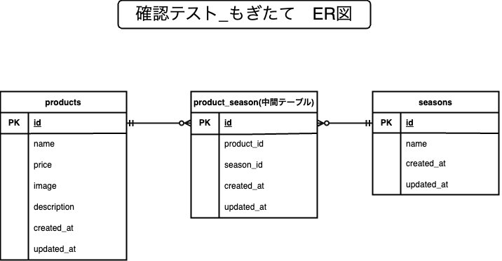

# 基礎学習ターム 確認テスト\_もぎたて

## 環境構築

Docker ビルド

    1.git clone git@github.com:jun-kikuchi-7221/mogitate.git
    2.DockerDesktopアプリを立ち上げる
    3.docker compose up -d --build
    ※ MacのM1チップのPCだったのでdocker-compose.ymlファイルの内容をそのままに
    docker compose up -d --buildをすると"no matching manifest for linux/arm64/v8 in the manifest list entries"というエラーが出るので下記のようにコンテナ毎に"platform: linux/x86_64"を追記した。
    またファイル先頭の"version '3.8'"の記述"も不必要だった為、削除した。

    例：
    mysql:
    platform: linux/x86_64(この文追加)
    image: mysql:8.0.26
    environment:

Laravel 環境構築

    ※docker composeコマンドは今のバージョンでは間のハイフンが不必要になり半角スペースで良くなった。
    仮にハイフンを入れるとエラーが出るので注意。
    1.docker compose exec php bash
    2.composer install
    3.「.env.example」ファイルから「.env」ファイルに内容をコピー。
    4.「.env」ファイルの環境変数の値を下記に変更

    DB_CONNECTION=mysql
    DB_HOST=mysql
    DB_PORT=3306
    DB_DATABASE=laravel_db
    DB_USERNAME=laravel_user
    DB_PASSWORD=laravel_pass

    5.アプリケーションキーの作成
    php artisan key:generate

    6.マイグレーションの実行
    php artisan migrate
    
    7.シーディングの実行
    php artisan db:seed

## 使用技術

    ・PHP 7.4.9
    ・Laravel Framework 8.83.8
    ・Mysql 8.0.26

## ER 図

## URL

    ・開発環境:http://localhost/
    ・phpMyAdmin：http://localhost:8080/
